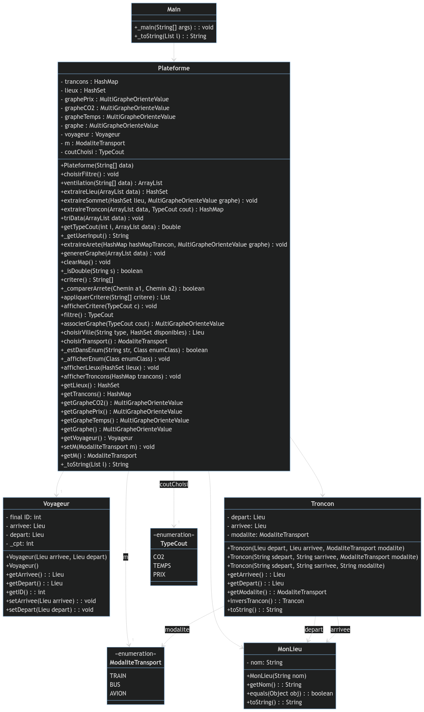
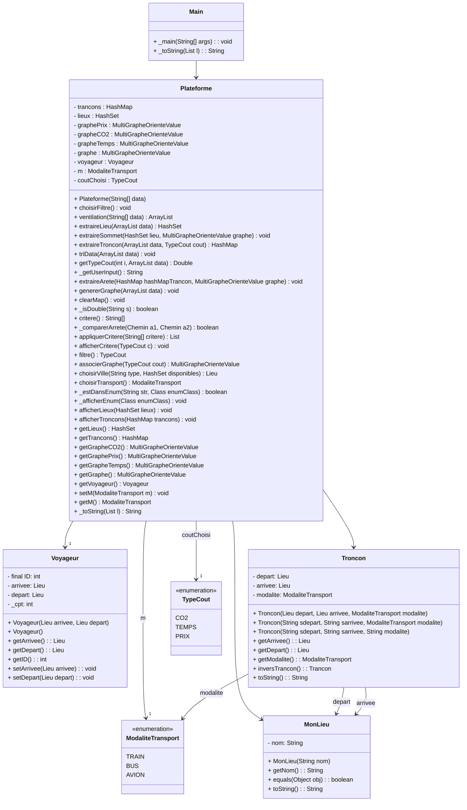
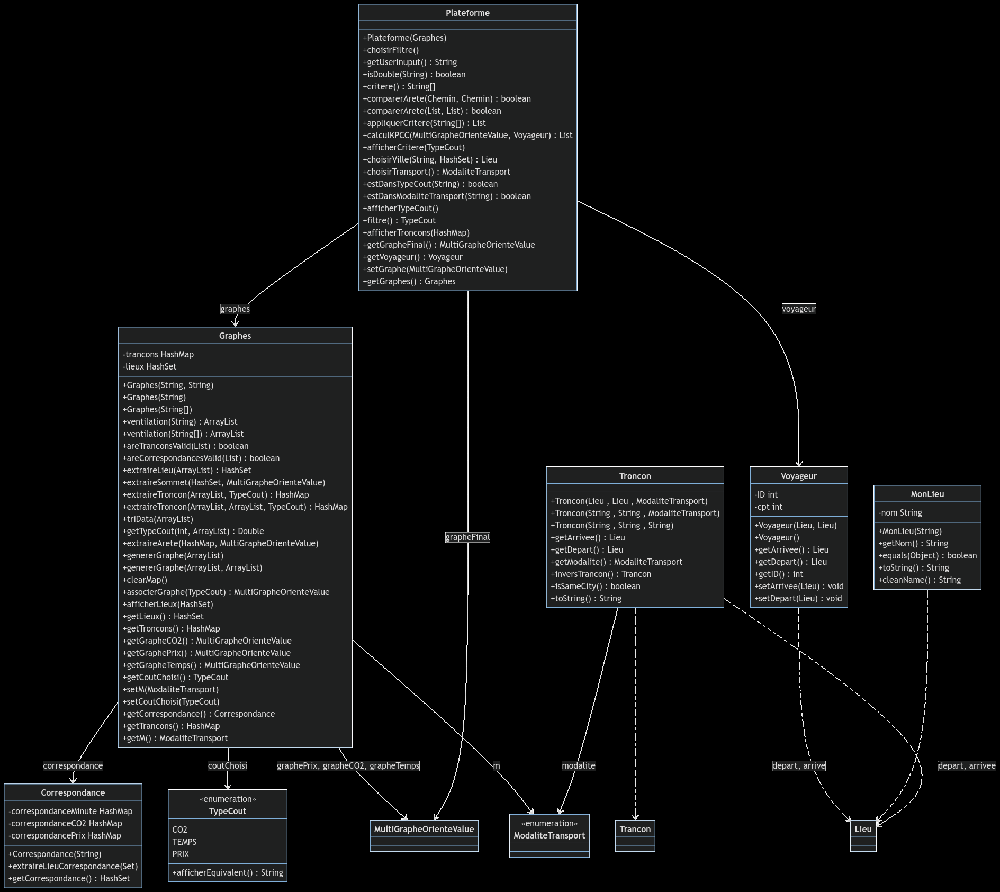
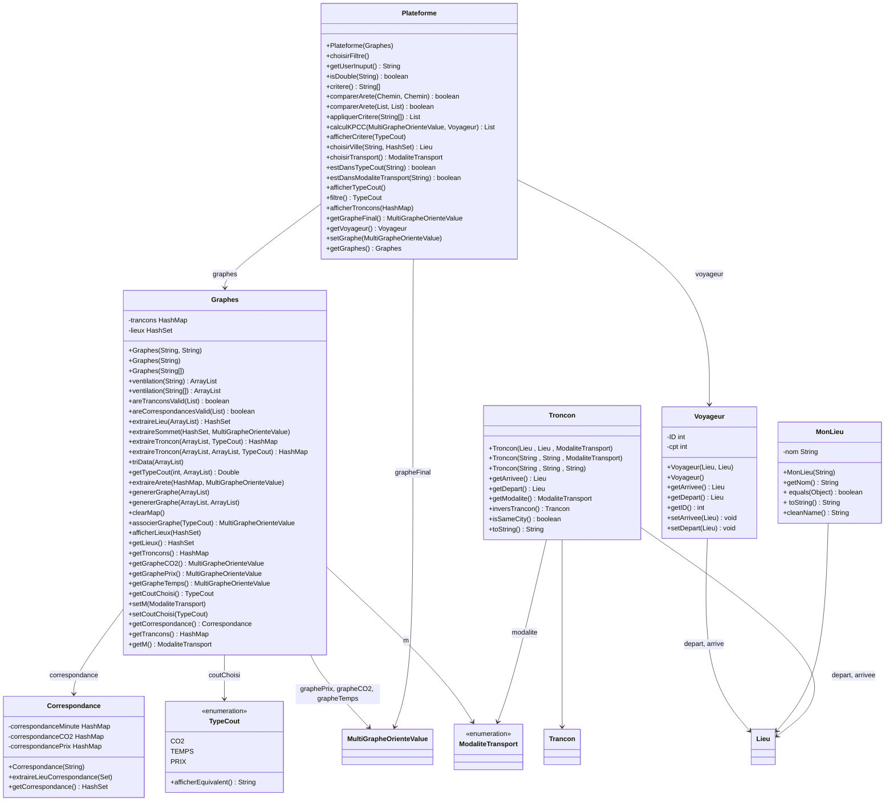

# SAE S2.02 – Rapport pour la ressource Dev

*SERE Benjamin,  LEGRAND Alexandre,  POUPARD–RAMAUT Rémi*

**Version 1 :**

## Commande pour lancer Application.jar

```sh
java -jar Application.jar
```

## Architecture permettant l’éxecution du projet en dehors d’Application.jar

```
klonk@ordidefou:~/Documents/cours/F5$ tree
.
├── Application.jar
├── bin
│   ├── app
│   │   ├── Main.class
│   │   ├── Plateforme.class
│   │   └── Voyageur.class
│   └── graphes
│       ├── MonLieu.class
│       ├── Troncon.class
│       └── TypeCout.class
├── dev
│   ├── rapport_dev.md
│   └── UML
├── lib
│   ├── jgrapht-core-1.5.1.jar
│   ├── jheaps-0.14.jar
│   ├── junit-platform-console-standalone-1.10.2.jar
│   └── sae_s2_2024.jar
├── src
│   ├── app
│   │   ├── Main.java
│   │   ├── Plateforme.java
│   │   └── Voyageur.java
│   └── graphes
│       ├── MonLieu.java
│       ├── Troncon.java
│       └── TypeCout.java
└── test
    └── app
        └── TestPlateforme.java
```

## Diagramme UML



## Diagramme UML en mermaid.js



## Explication de l’architecture

Les programmes java sont séparés en deux packages :

- **graphe** :
  - contient l’enum `TypeCout` qui liste les différents critères
  - contient les classes `MonLieu` et `Troncon` qui implémentent respectivement les interfaces `Lieu` et `Trancon` qui sont fournies dans l’archive jar `sae_s2_2024.jar`.
  
- **app** :
  - contient les classes `Main`, `Plateforme` et `Voyageur`. Elles utilisent les classes présentes dans `graphes`. `Voyageur` sert à représenter l’utilisateur auprès de `Plateforme`. `Plateforme` créé les graphes en fonction des input et des données de l’utilisateur. `Main` se lance au démarrage de `Application.jar` et appelle successivement les fonctions permettant à l’utilisateur d’interagir avec la classe `Plateforme`.

## TestPlateforme.java

La classe de test `TestPlateforme.java` implémente 10 tests différents sur la classe `Plateforme`.

**Version 2 :**

## Commande pour lancer Application.jar

```bash
java -jar Application.jar
```

## Architecture permettant l’exécution du projet en dehors d’Application.jar

```bash
klonk@ordidefou:~/Documents/F5$ tree
.
├── Application.jar
├── dev
│   ├── rapport.pdf
│   ├── UML
│   └── UML_v2.png
├── graphes
│   ├── exempleGraphe.png
│   ├── exempleGrapheV2.png
│   └── rapport_graphes.md
├── ihm
│   └── IHM_merged.pdf
├── lib
│   ├── jgrapht-core-1.5.1.jar
│   ├── jheaps-0.14.jar
│   ├── junit-platform-console-standalone-1.10.2.jar
│   └── sae_s2_2024.jar
├── README.md
├── res
│   ├── correspondance.csv
│   └── data.csv
├── src
│   ├── app
│   │   ├── Correspondance.java
│   │   ├── Graphes.java
│   │   ├── Main.java
│   │   ├── Plateforme.java
│   │   └── Voyageur.java
│   ├── exception
│   │   ├── CSVFormatException.java
│   │   ├── RoadNotFoundException.java
│   │   └── SameCityException.java
│   └── graphes
│       ├── MonLieu.java
│       ├── Troncon.java
│       └── TypeCout.java
└── test
    └── app
        └── TestPlateforme.java

12 directories, 27 files
```

## Diagramme UML



## Diagramme UML en mermaid.js



## Nouveau package

Ajout du package 'exception' avec les exceptions : 
  
  - `CSVFormatException.java` qui est renvoyée si une erreur est détectée dans le CSV.
  - `RoadNotFoundException.java` qui est renvoyée si aucune route n'est trouvée entre le lieu de départ et d'arrivée.
  - `SameCityException.java` qui est renvoyée si l'utilisateur entre la même ville pour le départ et pour l'arrivée.

## Correspondance.java

Pour gérer les correspondances lors d'un itinéraire et éviter de lister tout les arrêts qui se font lors d'un voyage, nous avons décidé de créer une classe `Correspondance.java` qui à elle seule importe le fichier CSV contenant les correspondances possible (par exemple passer du train à l'avion dans la villeC). Elle est ensuite utilisée par la classe [Graphes.java](#graphesjava)

## Graphes.java

La classe Graphe a été ajoutée afin de réduire la quantité de code présente dans la classe Plateforme. Désormais, la Plateforme possède un attribut graphe qui va contenir tout les chemins possible et un attribut grapheFinal qui correspond au graphe auquel on a appliqué le critère choisi par l'utilisateur.

## Quelques fonctions ajoutées

- ### Graphes.java 
  - Surcharge des méthodes ventilation, extraireTroncon et genererGraphe afin de conserver la rétrocompatibilité.
  - Ajout de `areTranconsValid(List) : boolean` qui vérifie la validité des tronçons présent dans le data.csv, celui-ci renvoie un booléen false si une erreur est détectée.
  - Ajout de `areCorrespondancesValid(List) : boolean` qui vérifie la validité des correspondances inscrites dans correspondances.csv, cette méthode renvoie également un booléen false si une erreur est détectée.
  - Modification de `afficherLieux(HashSet) : void`, après en cette méthode n'affiche plus que les lieux dit, c'est à dire qu'elle n'affichera pas "villeC, Avion" par exemple.

- ### Plateforme.java
  - Ajout de `calculKPCC(MultiGrapheOrienteValue, Voyageur) : List`, cette méthode calcule les plus courts chemins dans le graphe passé en paramètre avec le voyageur correspondant. Cette méthode permet de calculer au mieux un trajet qui commencerait par une ville avec une correspondance ou bien qui irait vers une ville avec une correspondance.
  - Modification de `appliquerCritere(String[]) : List`, étant donnée que nous avons fait une méthode pour calculer les KPCC alors nous avons modifié cette méthode afin d'y ajouter l'appel à `calculKPCC(MultiGrapheOrienteValue, Voyageur) : List`.

- ### TypeCout.java
  - Ajout de `afficherEquivalent() : String` qui renvoie une String plus représentative du cout choisi, elle renverra par exemple "min" si le temps est choisi.

- ### MonLieu.java
  - Ajout de `cleanName() : String` qui renvoie une String à partir d'un `MonLieu`, cette méthode va le convertir en une String avant de récuperer uniquement la première partie de celui-ci avant la 1ère vigule. Elle renvoie donc "villeC" si l'objet courant se nomme "villeC, AVION".

- ### Troncon.java
  - Ajout de `isSameCity() : boolean` qui regarde l'égalité entre l'arrivé et le départ, en sachant que ceux-ci sont comparés avec leurs noms qui sont passés par `cleanName() : String`. Ainsi, cette méthode renverra true si un tronçon a "villeC" en départ et "villeC, AVION" en arrivé.

## TestPlateforme.java

Enfin nous avons modifié notre classe de test afin de couvrir l'ajout des correspondances. Nous avons également rajouté un test qui couvre une situation possible d'un plus court chemin entre villeA et villeD.